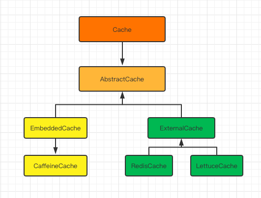

# KCache

这是一个多级缓存中间件，目的是为了整合进程内缓存和进程外缓存。
比如说将高频访问的数据存储在进程内部。从而避免了网络开销。
进程内的缓存支持 [Caffine]
进程外缓存支持 [Redis] [Lettuce]

核心原理和思想来自于Alibaba的JetCache项目。
有对JetCache感兴趣的人，可以去查看JetCache的源代码。
本人开发这个项目目的仅仅只是***为了学习用途，请勿用作其他用途***。

## 基本模块
   总共分为三大模块，
        分别是核心模块 core
        autoconfigure 模块，
        aop模块
        
   * KCache-Core
        封装了对缓存操作的核心实现逻辑。
        提供了builder 函数来创建Cache。
        提供了最基础的CacheConfig来封装配置。
        
    * KCache-autoconfigure
        用于config的自动装配，从配置文件中读取配置信息。
        然后 生成核心的CacheInitializer类，并管理起来。
        CacheInitializer 主要用于后期在AOP 模块生成对应的Cache。
        
    * KCache-Aop
        使用了org.aspectj.aspectjweaver. 来生成AOP 切面。
        并解析 方法上的注解到配置中。
        通过上一步自动配置生成的CacheInitializer 生成每个方法对应的cache，
        同时也会将生成好的cache 实例管理起来，方便后续的使用。
        
        总共有三种类型的cache。
        cacheable （用于读请求）
        cacheEvict（用于删除）
        cacheUpdate（用于更新）
    
    ## Cache-Core 基本框架。
    
    
    
    ## KCache 基本使用
    
    > 公共配置
        kcache
          local     // 本地缓存配置
            default // 缓存区域默认为default，必须设置
              cache_type: caffine
              encoder: kryo
              decoder: kryo
              expireAfterWrite: 200
              expireAfterAccess: 200
              cacheNullValues: true
              limit: 1500          
          remote    // 远端缓存配置
            default
              cache_type:redis/lettuce          
              encoder: kryo
              decoder: kryo
              expireAfterWrite: 200
              expireAfterAccess: 200
              cacheNullValues: true          
              host: xxx
              port: xxx
              db: 0
              password: xxx
              timeOut: xxx
              clientName: xxx
              ssl: false
              master: xxx
    
    > 提供的注解
    （1） @EnableCreateKCache 用于生成KCache 需要在main方法注明
    
    （2）@Cacheable 注解 （生成读缓存的实例）
| area            | cache区域                          |
|-----------------|----------------------------------|
| timeUnit        | 时间单位                             |
| expire          | 过期时间                             |
| name            | cache实例名称                        |
| localExpire     | 本地过期时间                           |
| cacheType       | cache类型，是local 还是 remote 还是 both |
| key             | SpEL 表达式，生成key实例                 |
| cacheNullValues | 是否cache null值                    |
| localLimit      | 本地数量                             |

    
  （3） @AllowPenetration 注解（需要和其他注解搭配使用，是否允许多线程加载，配置的话表示只允许单线程加载）
  
| timeUnit | 时间单位      |
|----------|-----------|
| timeOut  | 单线程加载等待时间 |

（4）@CacheEvict 注解（用于删除缓存）

| area      | cache区域                          |
|-----------|----------------------------------|
| name      | cache实例名称                        |
| key       | cache key，为SpEL表达式               |
| cacheType | cache类型，是local本地还是remote， 还是both |
| multiKeys | 生成的key 是单个key，还是多个key（list类型）    |

（5） @CacheUpdate注解 （用于更新缓存）
| area      | cache区域                          |
|-----------|----------------------------------|
| name      | cache实例名称                        |
| key       | cache key，为SpEL表达式               |
| cacheType | cache类型，是local本地还是remote， 还是both |
| multiKeys | 生成的key 是单个key，还是多个key（list类型）    |
